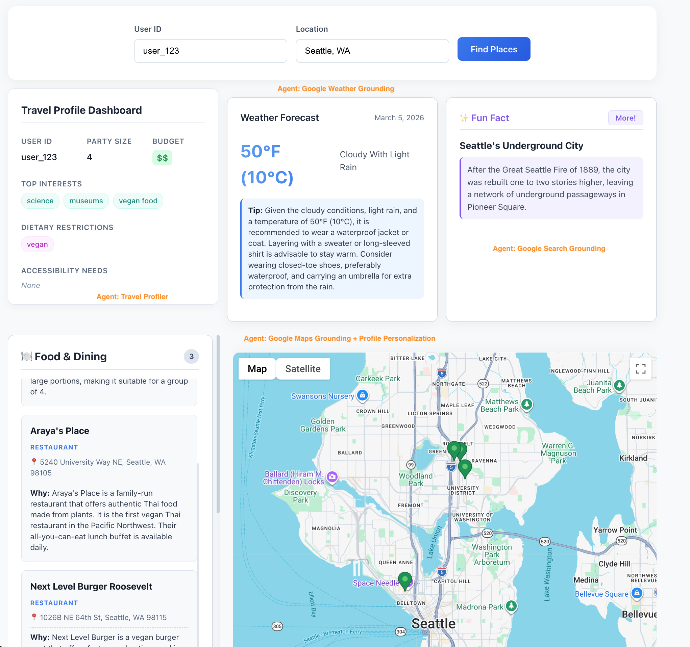
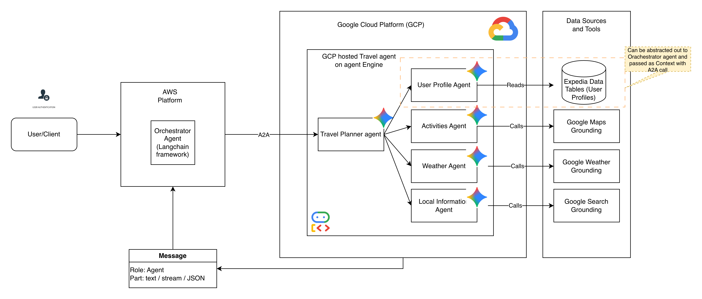

# maps_agent
Agent suggesting places with Google maps grounding and use preference

start backend:
uvicorn main:app --port 8080 --reload

start frontend:
cd frontend && source ~/.nvm/nvm.sh && npm run dev
source ~/.nvm/nvm.sh && npm run dev -- --host

kill service:
lsof -ti :8080 | xargs kill -9 

run frontend locally:
cd frontend
export NVM_DIR="$HOME/.nvm"
[ -s "$NVM_DIR/nvm.sh" ] && \. "$NVM_DIR/nvm.sh"
nvm use node
npm run build
npm run dev

---

## UI Sample

The frontend leverages React to provide a personalized **Travel Concierge** dashboard:
- **Travel Profile Dashboard**: Displays the user's fetched profile from BigQuery (e.g., Party Size, Budget, Interests like Science & Museums, Dietary Restrictions).
- **Weather Forecast**: Shows current real-time weather and dressing suggestions powered by the Weather Agent with Google Search Grounding.
- **Fun Fact**: Displays situational trivia about the destination (e.g., Seattle's Underground City) utilizing a dedicated agent.
- **Dynamic Map & Places List**: A Google Map instance showing interactive markers linked to a categorized list of custom Food & Dining or Sights & Activities recommendations.

## Architecture

The Maps Agent uses a multi-agent orchestration pattern spanning AWS and GCP:

1. **Client Request**: User interacts with the UI, which calls an Orchestrator Agent (Langchain framework) hosted on AWS.
2. **Travel Planner Orchestration (GCP)**: The AWS agent delegates agentic work via A2A calls to the **Travel Planner Agent** running on the GCP Agent Engine. 
3. **Sub-Agents & Grounding**: The Travel Planner acts as a router, invoking specialized agents in parallel:
   - **User Profile Agent**: Reads user profile constraints from data tables (e.g., Expedia Data Tables / BigQuery).
   - **Activities Agent**: Calls Google Maps Grounding to find points of interest that match the user profile.
   - **Weather Agent**: Calls Google Weather/Search Grounding to get up-to-date meteorological conditions.
   - **Local Information Agent**: Calls Google Search Grounding to fetch situational trivia and context about the area.
4. **Response**: The specialized outputs are formatted and returned sequentially to populate the React frontend.
